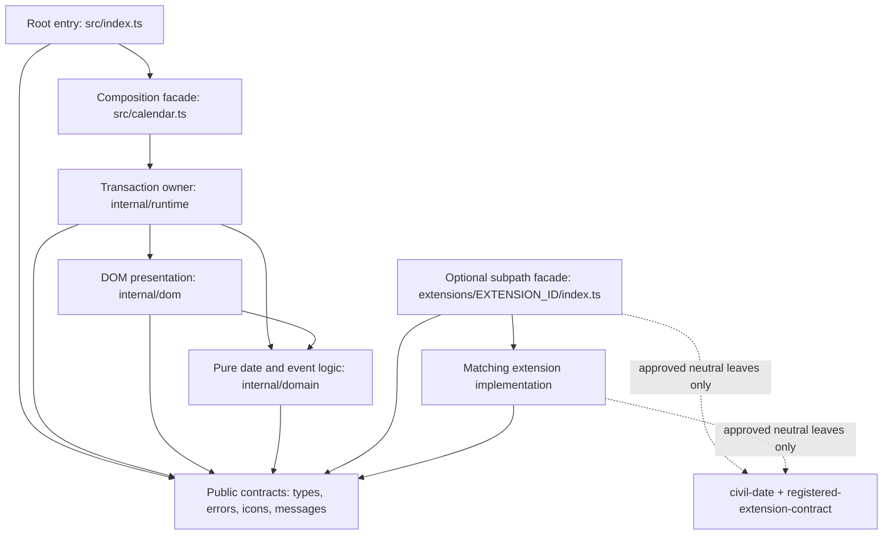

# Internal architecture

This guide helps contributors decide where a change belongs and which invariants must survive a refactor. It describes repository ownership and dependency direction rather than adding another consumer contract. Public signatures and lifecycle belong to the [API reference](api.md), optional component invariants belong to the [first-party extension guide](first-party-extensions.md), visual behavior belongs to [DESIGN.md](../DESIGN.md), interaction and accessibility behavior belongs to the [accessibility guide](../ACCESSIBILITY.md), and failure semantics belong to the [error guide](errors.md).

## Dependency direction

The root package has one composition edge into the generic runtime. Optional extension facades form separate public composition edges and never become root imports:



The arrows show allowed direction, not a requirement to use every lower layer. For example, a runtime policy that only needs public types should not import DOM or domain modules just because it may do so. The missing root/runtime-to-extension arrow is intentional: an optional subpath must remain unreachable from the root graph.

| Area | Owns | Dependency rule |
|---|---|---|
| Root facade and contracts | `index.ts`, `calendar.ts`, public types, errors, icons, messages, defaults, the opaque `CalendarExtension` type, and pure message formatting | `calendar.ts` is the intentional composition entry into the generic coordinator. It may host package-issued extension values but never imports an optional extension facade or implementation. Other contract modules remain independent of runtime implementation. |
| `extensions/<id>` facades | One pure named factory and its extension-specific option types | Each explicit package export composes only its matching implementation with the neutral extension contract. It performs no browser work at module scope and is never re-exported from root. |
| `internal/domain` | Gregorian civil-date parsing and arithmetic, ranges, bounds, fixed month grids, and atomic event normalization | No DOM or runtime imports. Domain code may use public types and errors. |
| `internal/dom` | Stable semantic element creation, localized presentation, focus helpers, and bounded DOM rendering primitives | May use domain and public contracts, but does not own lifecycle, requests, or state transitions. |
| `internal/runtime` | Option normalization, event-source generations, actions, consumer render-hook isolation, generic registered-extension lifecycle, integration-node leases, swipe state, observable state, and transaction coordination | May compose public, domain, DOM, and focused runtime peers. Root-reachable modules remain neutral and must not import a specific optional extension implementation. Runtime modules do not themselves become public subpath APIs. |
| `src/styles/*.css` and `scripts/lib/styles.mjs` | Implementation of [DESIGN.md](../DESIGN.md), responsive preferences, direction, and public-token authoring | The composer preserves readable source modules and the canonical cascade, then minifies the package's one public `dist/styles.css`; layout remains CSS-only. |

Do not add internal barrel files, cross-layer cycles, extension-to-extension imports, or a generic catch-all helper module. Import the narrow module that owns the behavior. The repository ESLint architecture rule enforces these layer edges, permits `calendar.ts` to compose the root surface with the runtime coordinator, and permits each public extension facade to compose only its matching implementation.

Extension implementation files may use root public contracts and the small neutral internal leaves explicitly allowed by the ESLint rule. They must not reach into package DOM presentation, coordinator state, or another extension.

## Where a change belongs

| Change | Primary location |
|---|---|
| Civil-date parsing, comparison, projection, range math, or locale week start | `internal/domain` |
| Stable markup, native semantics, localized display formatting, or focus mechanics | `internal/dom` |
| Configuration validation, source timing, abort/reentrancy policy, actions, render hooks, generic extension hosting, integration leases, or state | `internal/runtime` |
| WebMCP schemas, registration, bounded result projection, and unregister lifecycle | The WebMCP extension implementation reached only through `extensions/webmcp`; never the root coordinator, DOM presentation, or domain parsing |
| Public names, callback shapes, defaults, exports, or diagnostics | Root contract modules plus the API documentation and examples |
| Responsive placement, sizing, focus visuals, forced colors, or motion styling | `DESIGN.md`, `src/styles/*.css`, `scripts/lib/styles.mjs`, the CSS token contract, `scripts/tests/styles.test.mjs`, and affected browser tests |

A formatter or renderer that can be tested without calendar lifecycle state should normally be a DOM or domain leaf rather than another coordinator method. A helper that decides whether a source result may commit belongs to the runtime because it participates in the transaction.

## Representative DOM presentation leaves

These focused DOM presenters illustrate the boundary; the table is not an exhaustive module inventory. They build or update bounded presentation state, but never admit application work or decide whether a runtime transaction may commit.

| Module | Owns | Coordinator retains |
|---|---|---|
| `internal/dom/agenda.ts` | Detached ordered-list items, empty/progress content, the native Show more control, and bounded action references | Snapshot selection, visible counts, commit timing, listeners, render hooks, and focus restoration |
| `internal/dom/event-representation.ts` | Native link/button/static roots, semantic time and title nodes, and render-hook slots shared by grid and agenda surfaces | Action generations, callback invocation, render-hook execution, and cleanup |
| `internal/dom/issue-region.ts` | Rendering one accepted issue into the stable panel and updating the existing Retry control in place | Classification, severity, admission, stale diagnostics, Retry eligibility, and Retry actions |
| `internal/dom/announcement.ts` | Live-region clearing, exact message/politeness deduplication, urgency routing, and a prepared DOM update | Message selection, `onAnnounce` ownership, generation checks, scheduling, and stale-update suppression |

## Render transaction ownership

The coordinator's `MonthCalendar` class is the sole transaction owner, but it remains an orchestrator rather than a policy container. Focused runtime modules own source-shape classification, PromiseLike observation, source-error construction, and other separable concerns; the coordinator retains generation checks and atomic state/DOM commits.

### Instance lifetime

1. Construction snapshots and validates application options, render-hook definitions, and opaque extension values before package DOM is committed.
2. `render()` establishes one stable package-owned shell, acquires application-node leases, and starts the first source generation for one complete 42-day request range.
3. Configured first-party extensions activate in caller order after the initial direct terminal render or initial PromiseLike loading render. WebMCP registers its tools inside its own activation rather than through a core import.
4. `destroy()` makes retained capabilities inert, tears down extensions in reverse order, aborts remaining source work, runs consumer render-hook cleanup, releases leases, restores managed fallback state, and removes package ownership.

### Successful visible-range source and render order

```mermaid
sequenceDiagram
  accTitle: Successful visible-range source and render order
  accDescr: Every load claims a generation and aborts the prior request. Direct arrays commit once. Promise-like results attach terminal handlers before the loading callback and render, then commit a terminal state after fulfillment. State observers run before the matching DOM replacement.
  actor Consumer as Application
  participant Coordinator
  participant Source as Event input
  participant DOM as DOM presenters
  Consumer->>Coordinator: render(), range-changing navigation, setEvents(), or refetchEvents()
  Coordinator->>Coordinator: Claim generation N; abort generation N - 1
  Coordinator->>Source: Request the 42-day range with AbortSignal
  alt Direct array
    Source-->>Coordinator: Event array
    Coordinator->>Coordinator: Validate, normalize, index, commit terminal state
    Coordinator->>Consumer: onStateChange(ready or degraded)
    Coordinator->>DOM: Render terminal snapshot
  else PromiseLike
    Source-->>Coordinator: PromiseLike
    Coordinator->>Coordinator: Attach fulfillment and rejection handlers
    Coordinator->>Consumer: onStateChange(loading)
    Coordinator->>DOM: Render loading snapshot
    Source-->>Coordinator: Fulfilled event array
    Coordinator->>Coordinator: Check N; validate, normalize, index, commit terminal state
    Coordinator->>Consumer: onStateChange(ready or degraded)
    Coordinator->>DOM: Render terminal snapshot
  end
  Note over Coordinator,DOM: Current-generation checks guard provider work, normalization, callbacks, render hooks, and commits.
```

A direct array performs one terminal render without a loading or busy phase. A PromiseLike attaches both settlement handlers before publishing loading, then performs one loading render and one terminal render. Source rejection or invalid payload follows the same ownership and generation gates: a current failure enters the documented error-admission path, while stale work may be reported but cannot update state or DOM. See the [error guide](errors.md) for failure presentation and recovery.

Configured extensions receive state through their separate queued lifecycle after the consumer callback; the [first-party extension guide](first-party-extensions.md#capabilities-lifecycle-and-isolation) owns that ordering contract.

The immutable options snapshot keeps the construction-time `events` value, while the coordinator owns the current static array or provider without wrapping one as the other. `setEvents()` validates and snapshots a replacement before changing that input, then starts a new source generation. Abort-listener and validation-getter reentrancy must not let an older transaction reclaim source or controller ownership from a newer accepted replacement.

Keep generation checks and commit decisions in the coordinator or a focused runtime policy module. Do not let DOM renderers start requests, mutate public state, or decide whether stale work may commit.

Performance fast paths must preserve those ownership boundaries. Event indexing may parse once, sort once, and distribute occurrences because it is a pure domain operation. A calendar with no render hooks may skip hook-integrity snapshots and mount-context construction because those render regions contain no consumer render-hook nodes to protect; any configured hook set always uses the complete integrity and quarantine path. Shared and optional formatters belong to focused presentation helpers, and disabled features must avoid installing inactive listeners or observers. Full grid and agenda replacement remains the transaction boundary for selection and source commits until a partial-render design can preserve focus restoration, hook cleanup, quarantine recovery, and callback reentrancy together.

## Stable DOM and ownership invariants

- One live calendar owns a host at a time.
- One current interactive 42-day grid represents one committed provider range. Pager lanes are decorative and never contain a second event surface.
- The toolbar, title, grid shell, agenda shell, live regions, and issue regions stay stable across ordinary renders so focus and references survive.
- `toolbarEnd`, fallback content, and render-hook nodes remain application-owned. The package leases or mounts them according to their documented lifecycle instead of cloning or silently adopting them.
- Render-hook failures quarantine one consumer hook set and preserve the documented partial-render presentation. Registered-extension failures quarantine only that complete component and remain diagnostic-only, without weakening core calendar semantics.
- Responsive implementation must preserve the invariants owned by the [responsive design](../DESIGN.md#responsive-model) and [accessibility guide](../ACCESSIBILITY.md#responsive-and-direct-input-behavior); this architecture guide does not redefine them.
- Private `lfc-*` classes, IDs, attributes, containers, and keyframes may change; integrations use public options, callbacks, elements, and tokens instead.

## Localized and responsive text

Treat localized values as complete formatted strings:

- Use one `Intl.DateTimeFormat` call for each complete label. Do not concatenate localized month and year fragments or reconstruct structured values from display text.
- Keep one canonical full DOM string for a title, live-region value, or accessible name. A compact visual alternative is a separate `aria-hidden` presentation, not duplicate readable DOM text.
- Preserve locale-specific ordering, punctuation, numbering systems, and calendar formatting options in both full and abbreviated forms.
- Compare the next value with the current DOM value before writing to an `aria-live` region or referenced label; unrelated rerenders must not repeat an unchanged announcement.
- Locale-derived week starts accept the platform's method or accessor form of week information, validate `firstDay`, and use the documented Sunday fallback only when neither form is usable.

## Refactoring guidance

Extract a leaf module when it has one coherent responsibility, a narrow typed input, and tests that do not require reproducing coordinator lifecycle. Keep orchestration together when splitting it would distribute generation ownership, rollback, focus restoration, or error-state decisions across modules.

Before moving code, identify:

1. The owner of the input and output values.
2. Whether the behavior is pure, DOM-local, or transaction-sensitive.
3. Which stable DOM, accessibility, date, lifecycle, and teardown invariants are affected.
4. The focused regression test that proves the boundary after the move.

Prefer explicit names such as `month-title`, `message-configuration`, or `node-leases` over broad names such as `utils`, `helpers`, or `common`.

## Optional extension boundary

The root runtime resolves only package-issued opaque `CalendarExtension` values and supplies least-privilege capabilities. It must remain independent of how many extension subpaths ship. The absence of an extension import must mean its implementation is unreachable from the emitted root graph.

| Module | Responsibility |
| --- | --- |
| `src/internal/runtime/registered-extension-contract.ts` | Private issuance/authenticity protocol and least-privilege activation contract |
| `src/internal/runtime/registered-extension-host.ts` | Coordinator-facing extension host, presentation-event paging, and navigation transaction ownership |
| `src/internal/runtime/registered-extensions.ts` | Whole-array admission, lifecycle ordering, state delivery, quarantine, and reverse teardown |
| `src/internal/runtime/registered-extension-events.ts` | Bounded presentation-safe event facade shared by selected components |
| `src/internal/runtime/navigation-revision.ts` | Neutral navigation ordering across public and extension requests |
| `src/extensions/webmcp/index.ts` | Pure public `webMcp()` facade |
| `src/extensions/webmcp/configuration.ts` | Extension-specific synchronous option validation and defaults |
| `src/extensions/webmcp/execution-signal.ts` | Cross-realm execution cancellation validation and lifecycle fallback |
| `src/extensions/webmcp/runtime.ts` | WebMCP schemas, capability use, registration, tool execution, and disposal |

Each first-party extension factory validates and snapshots configuration synchronously, returns an immutable reusable value, and defers document access until activation. Extension IDs are stable and unique per calendar; duplicate IDs fail before host mutation. Distinct IDs always coexist, activation and state delivery follow caller order, and teardown reverses it. There is no dependency, priority, precedence, conflict, discovery, or global-registration mechanism.

An extension failure emits diagnostic-only `extension-failed` with its trusted `extensionId` and lifecycle `hook`. The manager aborts and disposes that extension exactly once, then continues independent work while the calendar remains live. Consumer visual hooks use the separate `render-hook-failed` / `renderHookId` channel and are not an extension-authoring surface.

The [first-party extension guide](first-party-extensions.md) owns public
composition, lifecycle, bundle behavior, and future third-party stability. The
[package verification guide](package-verification.md) owns emitted-graph and
packed-consumer evidence.

### Author an official extension

Extension authoring is package-private. A contributor adding an official
extension must:

- Add a pure `src/extensions/<id>/index.ts` entry, export one camel-case
  factory from `./extensions/<id>`, keep implementation details off the root,
  and make the stable kebab-case ID correspond to the factory. Treat
  `package.json#exports` as the public entry-point authority.
- Accept one extension-owned options object, reject unreadable or unknown
  input according to a documented symbol-key policy, snapshot retained values,
  and return only a package-issued opaque `CalendarExtension`. Entry
  evaluation and factory calls remain DOM-free.
- Keep the root graph independent, import only approved private contracts,
  request the least capability needed, and avoid peer-extension dependencies,
  priorities, conflict rules, or discovery metadata.
- Keep lifecycle hooks synchronous, bind asynchronous work to the lifetime
  signal, make quarantine and disposal idempotent, and preserve fail-closed
  behavior for retained capabilities.
- Treat platform and application values as untrusted, minimize projections,
  preserve authorization and bounds, use semantic accessible DOM where
  applicable, and update the security model for a new trust boundary.
- Update public API, consumer configuration, integration guidance, examples,
  and `CHANGELOG.md` without duplicating the private protocol.
- Cover absence, one and multiple instances, ordering, reentrancy, reuse,
  duplicates, quarantine, reverse teardown, cleanup failure, stale
  capabilities, hostile input, cancellation, and cross-instance isolation.
  Verify DOM-free entry evaluation and emitted core-only and extension-inclusive
  module graphs.

Every extension must preserve ordinary UI, state, accessibility, and error
presentation when it is absent, unsupported, or quarantined.

## Validation by change type

Use the [contributor validation matrix](../CONTRIBUTOR_COMMANDS.md#choose-focused-validation)
for copyable commands and the
[change-obligation table](../CONTRIBUTING.md#change-obligations) for companion
work. An architecture change must prove its affected dependency direction,
transaction ownership, teardown, failure isolation, public package graph, and
observable behavior as applicable.

DOM, CSS, interaction, or accessibility changes also require the affected
browser scenarios and manual checks in the
[accessibility guide](../ACCESSIBILITY.md). Public behavior changes require the
declarations, examples, API guidance, migration guidance, release notes, and
screenshot evidence identified by contributor policy. Finish with the
[complete repository gate](../CONTRIBUTOR_COMMANDS.md#run-the-final-gate).

[Back to the documentation hub](README.md)
