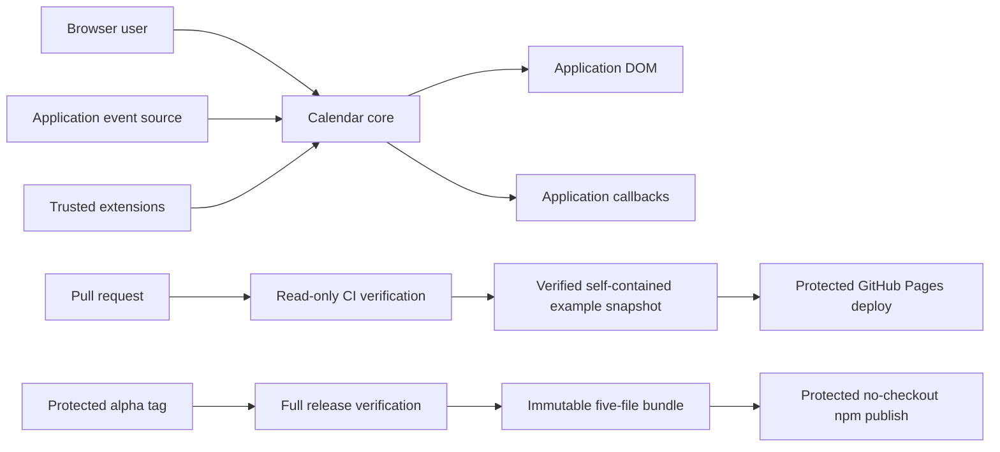

# litefold-calendar threat model

## Executive summary

litefold-calendar has two primary risk centers: untrusted event data crossing into an application's DOM and navigation surface, and repository changes crossing into public npm or example-site artifacts.  Runtime controls emphasize whole-snapshot validation, non-executable rendering, restricted links, bounded work, async generation guards, lifecycle isolation, and visible failures.  Supply-chain controls emphasize read-only pull-request CI, exact dependencies, clean committed source, a protected alpha tag, immutable artifact receipts and example paths, isolated npm and Pages authority, npm registry provenance, and auditable Pages deployments with visible version, commit, and channel identity.

## Scope and assumptions

In scope are `src/`, distributed ESM/CSS output, `scripts/`, `.github/workflows/`, repository configuration, and repository-owned examples.  Tests provide evidence but are not shipped runtime code.

The model assumes:

- The library runs in a modern browser inside an application-controlled document.
- Event records, provider timing, rejection values, URLs, colors, and metadata can be attacker-influenced.
- Options, callbacks, and extensions are trusted same-realm application code.  Failure containment is in scope; sandboxing JavaScript is not.
- Event data may be confidential.  Titles are intentionally rendered, while metadata and raw diagnostic causes must remain out of package-owned presentation.
- Application transports, authentication, authorization, tenant isolation, recurrence, time-zone conversion, caching, routes, and server-side rate limits remain application responsibilities.
- GitHub and npm protections are external controls.  Repository files describe their required configuration but cannot verify that hosted settings are enabled.

## Components and trust boundaries

| Boundary | Data or authority crossing it | Primary controls |
| --- | --- | --- |
| Application event source → core | Event arrays, timing, failures, URLs, metadata | Abort signal, complete-range contract, strict atomic normalization, duplicate rejection, count/string bounds, safe URL policy |
| Browser user → calendar DOM | Keyboard, pointer, touch, pen, precision-scroll input | Native controls, managed grid semantics, guarded actions, focus identity, boundary checks, one interactive grid |
| Calendar → application callbacks | Normalized events, dates, DOM references, state, errors | Typed contexts, safe presentation/diagnostic separation, observed promises, lifecycle guards |
| Trusted extension → owned slots | Same-document nodes and cleanup code | Node leases, ownership checks, abort signals, cleanup, failure quarantine; no sandbox claim |
| Contributor → CI | Source and workflow changes | Read-only permissions, full-SHA actions, no `pull_request_target`, locked script-disabled install, lint/type/policy/tests |
| Protected release tag → verified bundle | Reviewed source commit and build tooling | Tag/version/repository checks, `main` ancestry, complete quality gate, clean-source packaging, checksum, integrity, receipt, SBOM, license |
| Verified Actions artifact → npm | Exact tarball and OIDC identity | Protected `npm` environment, no source checkout, flat-file/hash/receipt/manifest validation, trusted publishing, provenance, `alpha` tag |
| Verified static snapshot → GitHub Pages | Built examples, retained release paths, rolling preview, Pages OIDC identity | Self-contained asset scan, visible version/commit/channel, byte-different overwrite rejection, retained `pages-content` history, protected `github-pages` environment |

## Assets and objectives

| Asset | Objective |
| --- | --- |
| Application DOM and navigation | Prevent untrusted content from becoming executable markup, style, selector, handler, or unsafe URL |
| Event data and metadata | Avoid accidental disclosure and stale/wrong-range presentation |
| Calendar state and ownership | Prevent races, detached-node activation, and cross-instance cleanup |
| Main-thread capacity | Bound package-owned parsing, rendering, and strings |
| Error and recovery channel | Keep failures visible, safe, and recoverable |
| Source, tarball, receipts, npm identity, and example deployments | Publish only reviewed bytes from the intended repository and commit; preserve version-specific demo bytes |
| GitHub, Pages, and npm maintainer authority | Keep repository write, Pages OIDC, and npm OIDC privileges isolated from untrusted code and from each other |

## Attacker capabilities

An attacker may control one or more event fields, provider timing or rejection, duplicate or oversized results, metadata objects, and ordinary browser input.  A malicious contributor may submit source or workflow changes intended to add a dependency, lifecycle hook, unsafe sink, or privileged pull-request path.  An external actor may attempt package-name confusion or account compromise.

The attacker is not assumed to already control host application code, trusted extensions, the application origin, GitHub administrators, npm maintainers, or the browser platform.  Those compromises remain important but cross a different trust boundary.

## Abuse cases and controls

| ID | Abuse case | Existing controls | Residual risk / required follow-up |
| --- | --- | --- | --- |
| TM-001 | Event text, color, metadata, or URL becomes executable content or unsafe navigation | Text-node rendering; exact date/color/URL validation; source and built-output sink scans; hostile-input tests | Trusted extensions can intentionally create arbitrary DOM; keep them reviewed |
| TM-002 | Oversized data freezes the page | Event, string, range, and rendered-item bounds; overflow UI; abort-aware provider contract | Application parsing and transport occur before package validation; enforce server/query limits |
| TM-003 | Slow or superseded work commits stale data or acts through detached nodes | Abort controllers, generation checks, node/fallback leases, expected-parent cleanup, lifecycle guards | Same-realm application code can still mutate owned DOM; preserve race and teardown tests |
| TM-004 | Callback or extension failure hides errors or produces unhandled rejection | Safe default panel/live regions, exact handled disposition, promise observation, sanitized state, failure quarantine | Applications can deliberately suppress their own UI; document ownership clearly |
| TM-005 | Malicious same-realm extension reads data, mutates DOM, or blocks execution | Explicit trusted-code boundary, scoped elements, abort/cleanup, node ownership | No browser-realm sandbox; do not accept untrusted extension code |
| TM-006 | Pull-request code gains npm or Pages authority, weakens package policy, or rewrites an immutable demo | Read-only workflow defaults, full-SHA actions, no `pull_request_target`, script-disabled locked installs, CodeQL/dependency review, source/output policy, separate protected environments, complete retained-snapshot assembly, byte-different release rejection | Hosted branch/ruleset and environment configuration, independent approval, and protection of `pages-content` are external |
| TM-007 | Release publishes bytes other than the reviewed tarball | Protected tag in `main`, full gate, clean-source five-file bundle, checksums/integrity/source receipt/SBOM/license, separate no-checkout OIDC job, exact tarball publish, provenance | Protected environment, tag rules, trusted-publisher binding, and npm account security must be configured externally |
| TM-008 | Users install a confusing package identity | Scoped package name, exact repository metadata, `alpha` dist-tag, provenance | Confirm npm scope/package control before first release; monitor for confusing names |

## Severity calibration

- **Critical:** untrusted event or pull-request input can reliably execute code for package users or publish without another privileged action.
- **High:** compromise can affect many consumers, release identity, or confidential event data but requires a protected account or realistic integration boundary.
- **Medium:** attacker-influenced data causes repeatable integrity, confidentiality, or availability loss within one host.
- **Low:** impact requires already-trusted same-realm code or is local, visible, and readily recoverable.

TM-006 and TM-007 remain the highest release priorities because a single workflow or account failure can affect every consumer.  TM-001 remains the highest runtime priority because the package executes in the host application's origin.

## Review focus

| Path | Security responsibility |
| --- | --- |
| `src/internal/domain/event-normalization.ts` and date/range modules | Untrusted snapshot parsing, URL policy, resource bounds |
| `src/internal/runtime/` | Async generations, actions, callbacks, state, extensions, teardown, diagnostics |
| `src/internal/dom/` | Semantic structure, managed focus, month picker, native interaction |
| `src/styles/*.css` and `scripts/lib/styles.mjs` | Ordered scoped styling, responsive/preference behavior, one composed public stylesheet, no dynamic style sink |
| `src/errors.ts` | Safe user messages and diagnostic separation |
| `scripts/check-package-policy.mjs` | Manifest, import, sink, dependency, built-output, and workflow policy |
| `scripts/pack-release.mjs` | Clean-source tarball, integrity, receipt, SBOM, license, and clean-consumer verification |
| `scripts/build-pages.mjs` and `scripts/assemble-pages.mjs` | Self-contained static assets, visible identity, retained releases, rolling preview replacement, and immutable-path enforcement |
| `.github/workflows/ci.yml` | Pull-request and main verification with no publication authority |
| `.github/workflows/publish-alpha.yml` | Tag verification, immutable artifact handoff, isolated trusted publishing |
| `.github/workflows/deploy-examples.yml` | Verified static snapshot handoff, retained deployment history, exact rollback, and isolated Pages authority |
| `docs/example-deployment.md` | Pages path, authority, rollback, and stale-deployment operator contract |
| `docs/releasing.md` | External controls and operator process that source cannot enforce |

## Validation expectations

Every security-relevant change should preserve hostile-input, async race, teardown, cross-instance, safe-link, error-presentation, package-policy, clean-consumer, static-deployment, and workflow assertions.  External GitHub, Pages, and npm settings must be checked manually before release and after any ownership, repository-name, environment, Pages-source, or workflow-file change.
