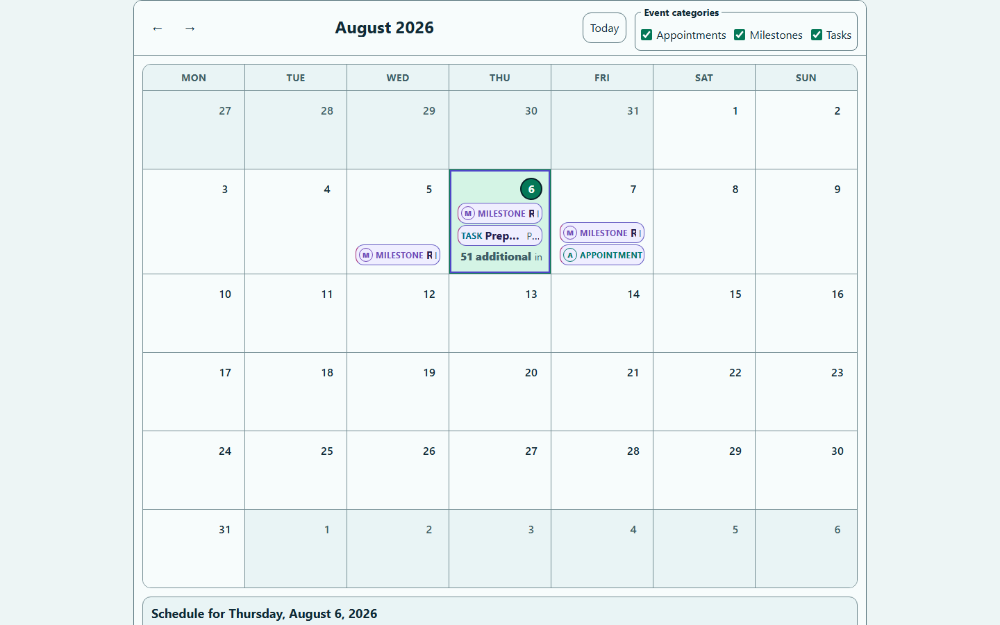
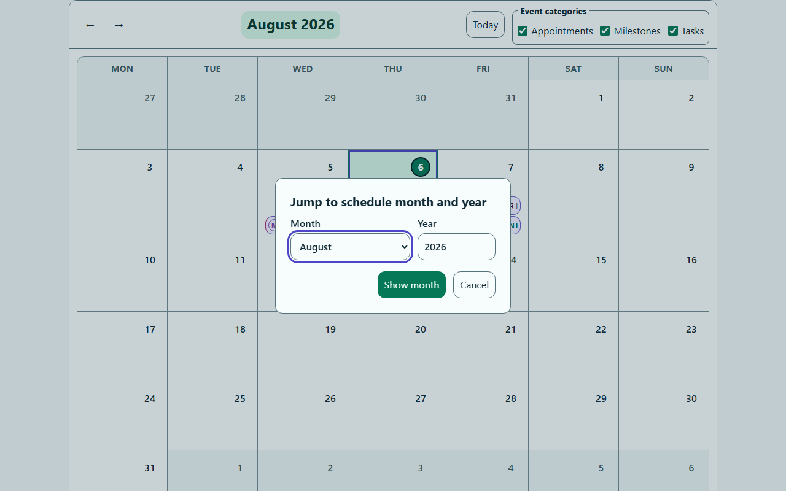
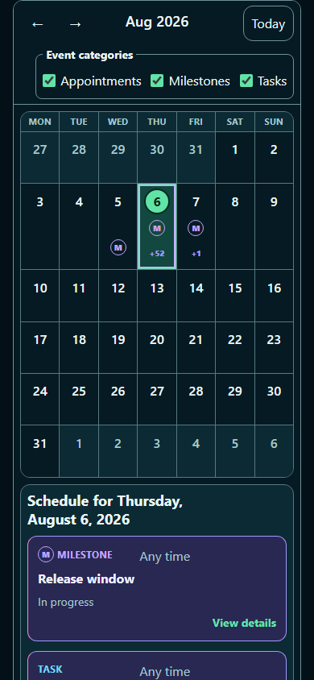
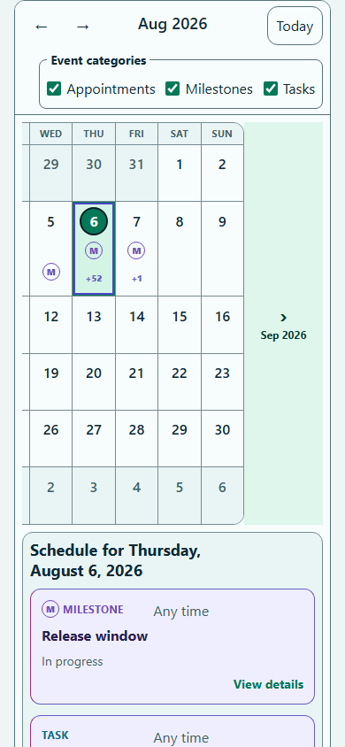
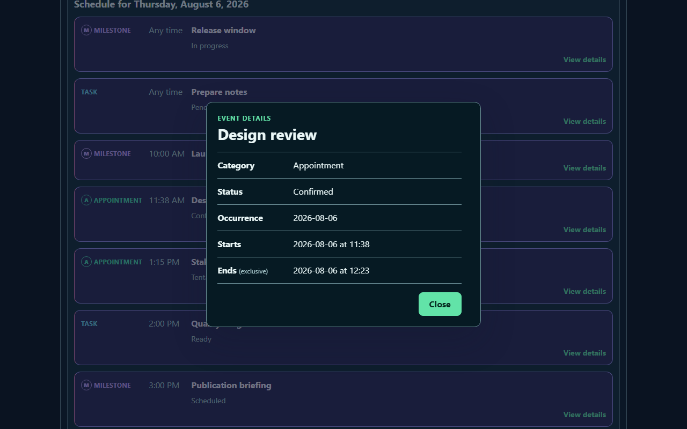
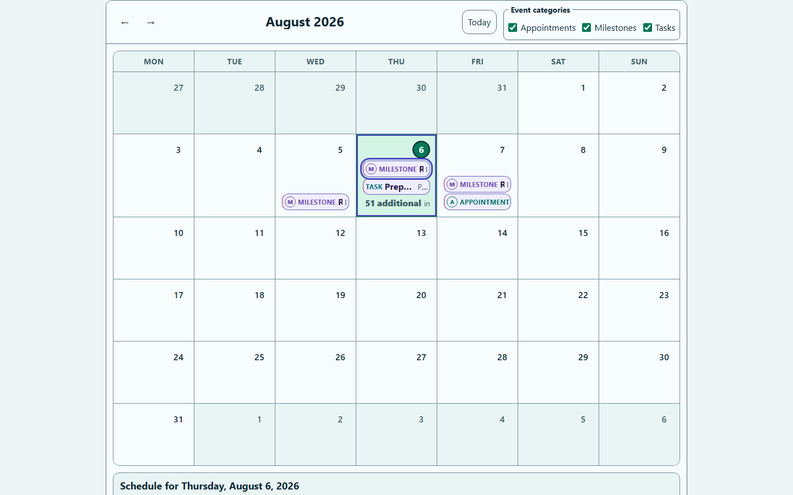

# Screenshot contract

Use this procedure when a change intentionally affects a canonical visual state. Screenshots are deterministic visual evidence generated from repository-owned examples with pinned Chromium. They document public behavior; they do not replace browser assertions, accessibility automation, or manual assistive-technology testing.

## Canonical scenes

The manifest covers exactly these PNG files:

| File | Scene | Viewport |
|---|---|---|
| `desktop-month-grid-1440x900.png` | Wide advanced month grid with direct event actions and overflow | 1440 × 900 |
| `month-year-jump-1280x800.png` | Open native month-and-year chooser at a bounded month | 1280 × 800 |
| `mobile-month-agenda-dark-390x844.png` | Compact dark navigation with the abbreviated `Aug 2026` title, month-grid event summaries, and selected-day agenda | 390 × 844 |
| `mobile-month-swipe-pull-390x844.png` | Held native touch pull with the abbreviated `Aug 2026` toolbar and decorative `Sep 2026` adjacent-month lane | 390 × 844 |
| `event-details-dark-1280x800.png` | Application-owned event details dialog opened from the agenda | 1280 × 800 |
| `grid-event-keyboard-focus-1440x900.png` | Visible keyboard focus on a wide-layout grid event action after F2 | 1440 × 900 |

Only the manifest-listed PNGs belong in this directory. Do not add alternate crops, renamed duplicates, consumer branding, private data, or externally supplied reference images.

## README and package policy

The root README embeds only the desktop month grid and mobile dark-theme agenda. Together they show the responsive and theme range without turning the GitHub and npm package landing pages into the complete six-scene review gallery.

npm always includes the root `README.md`, while the package `files` allowlist deliberately keeps `docs/screenshots/**` outside the tarball. The previews therefore add no installed package bytes. They use repository-relative Markdown images for same-branch GitHub rendering and npm's GitHub-backed README rendering. An offline renderer opened from an installed package cannot load the excluded PNGs; the hosted GitHub and npm READMEs are the intended preview surfaces. The manifest hashes remain the version-specific visual evidence; the README previews are a current product overview.

Because npm refreshes a package README only when a new version is published, release verification includes a package-page rendering check. Keep every embedded image repository-relative, use the manifest's exact descriptive alt text, and update manifest references whenever documentation adds or removes a capture.

## Reference gallery

### Desktop month grid



### Month and year picker



### Mobile dark-theme agenda



### Mobile touch paging



### Event details dialog



### Keyboard focus



## Update captures

Before capture, inspect `git status` so you can distinguish intentional source changes from unrelated work. The updater targets all six PNGs plus the root `screenshots.manifest.json`, even when some regenerated bytes remain unchanged.

Run from the repository root with Node 24.x and the exact npm version in `package.json#packageManager`:

```sh
npm ci --ignore-scripts
npx --no-install playwright install chromium
npm run screenshots:update
npm run check:screenshots
```

On a fresh Linux machine, add `--with-deps` to the Playwright install command when operating-system browser dependencies are also missing.

`screenshots:update` builds the package and advanced example, starts the repository-owned local server, fixes locale, time zone, color scheme, reduced motion, clock/data fixtures, viewport, and interaction state, and rewrites every canonical capture and manifest record. It does not build unrelated example routes or deployment metadata. Do not hand-edit or recompress the PNGs.

Five scenes capture settled states. The held-pull scene intentionally captures direct manipulation before release so the decorative adjacent-month/year lane can be reviewed; selection timing and post-release browser physics remain browser-test and supported-device concerns. Regenerate and review all six canonical scenes after an intentional source-layout change, even when only the two mobile scenes are expected to gain responsive label differences.

## Review checklist

Review each image at native dimensions and compare it with the intended change and [`DESIGN.md`](../../DESIGN.md):

- Confirm each scene-specific focus, selection, Today, overflow, navigation, month title, event marker, agenda, dialog, or month-picker state.
- In the settled mobile scene, confirm the title is `Aug 2026` and compact navigation, marker/count presentation, and agenda match the [responsive design](../../DESIGN.md#responsive-model), with no pager lane, offset, motion residue, clipping, or horizontal scrollbar.
- In the held-pull scene, confirm the toolbar is `Aug 2026`, there is one live grid, and the exposed lane shows the correct arrow and localized `Sep 2026` without event content.
- Treat captures as evidence only for their listed viewport and state. Use the browser and accessibility checks for uncaptured widths, text and page zoom, direction, contrast modes, and alternative marker or overflow combinations.
- Check for system-font drift, unexpected network content, and personal or secret data.

## Manifest and validation

The screenshot manifest is machine-owned and records, for every scene:

- Canonical filename and scene identifier.
- Example URL and deterministic setup steps.
- Viewport and output dimensions.
- SHA-256 hash.
- Source fingerprint covering package source and build configuration, the advanced route and its shared stylesheet, the exact build/server/capture helpers, and pinned compiler/browser inputs. The updater's invoked npm scripts and their automatic `pre`/`post` hooks are included. Other example routes, deployment metadata, Playwright's test configuration, root version metadata, and npm scripts outside that capture lifecycle are excluded so unrelated changes do not require recapture.
- Exact Node patch used for capture; validation accepts that provenance when it belongs to major version 24, while npm, Playwright, and Chromium remain exact-pinned.
- Documentation references and exact alt text.

`check:screenshots` fails when a canonical scene is absent, dimensions or hash differ, the source fingerprint is stale, a documented reference or alt text is missing, or an orphaned screenshot asset exists. A deliberate visual change must update implementation, captures, manifest, references, and alt text together.

## Troubleshooting

- If Chromium is missing, rerun `npx --no-install playwright install chromium`; do not substitute a system browser.
- If tooling reports the wrong npm version, switch to the exact `packageManager` version before capture.
- If hashes or pixels changed unexpectedly, investigate browser/toolchain drift, fixtures, fonts, animation, layout timing, and network requests before updating evidence.
- If only part of the visual contract intentionally changed, still review all six rewritten images; unchanged scenes should remain byte-identical.

Never accept unexplained diffs. A deliberate visual change must update the implementation, captures, manifest, documentation references, and alt text together.
