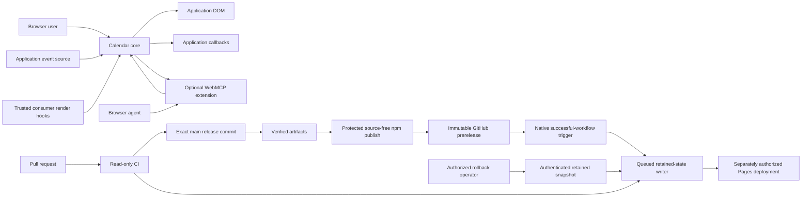

# Security model

## Executive summary

Litefold Calendar has three primary risk centers:

1. Untrusted event data crossing into an application's DOM, navigation, and error surfaces.
2. Optional WebMCP arguments and structured calendar results crossing between a browser agent and a live calendar instance.
3. Repository changes crossing into public npm, GitHub release, and example-site artifacts.

Runtime controls emphasize atomic validation, non-executable rendering, restricted links, bounded work, asynchronous generation guards, lifecycle isolation, and visible failures. WebMCP remains an explicit optional extension, bounded, same-origin, and tied to render/destroy ownership. Supply-chain controls preserve exact-source verification, immutable artifacts, isolated publication authority, provenance, and post-publication identity checks.

Package users should focus on the assumptions, runtime trust boundaries, and TM-001 through TM-008. Maintainers changing build, release, or Pages workflows should also review TM-009 through TM-012, the path ownership table, and the validation matrix. These abuse cases are review targets, not confirmed vulnerabilities.

## Scope and assumptions

In scope are `src/`, distributed ESM/CSS output, `scripts/`, `.github/workflows/`, repository configuration, repository-owned examples, and registrations created by the optional WebMCP extension. Tests provide evidence but are not shipped runtime code.

The model assumes:

- The library runs in a modern browser inside an application-controlled document.
- Event records, provider timing, rejection values, URLs, colors, metadata, WebMCP inputs, and returned event titles can be attacker-influenced.
- Options, callbacks, and consumer `CalendarRenderHooks` are trusted same-realm application code. Official `CalendarExtension` implementations are package code selected by the application. Failure containment is in scope; sandboxing JavaScript is not.
- Event data may be confidential. Titles are intentionally rendered; when WebMCP is enabled, paged results can enumerate every source event intersecting an allowed date in the loaded visible range and include title plus raw normalized start/end civil values regardless of visual time settings. Metadata, URLs, identifiers, and raw diagnostic causes remain excluded from site-tool output.
- Application transports, authentication, authorization, tenant isolation, recurrence, time-zone conversion, caching, routes, and server-side limits remain application responsibilities.
- GitHub and npm protections are external controls. Repository files describe required configuration but cannot prove that hosted settings are enabled.

## Components and trust boundaries

| Boundary | Data or authority crossing it | Primary controls |
| --- | --- | --- |
| Application event source → core | Event arrays, timing, failures, URLs, metadata | Abort signal, complete-range contract, strict atomic normalization, duplicate rejection, count/string bounds, safe URL policy |
| Browser user → calendar DOM | Keyboard, pointer, touch, pen, and precision-scroll input | Native controls, managed grid semantics, guarded actions, focus identity, bounds, one interactive grid |
| Calendar → application callbacks | Normalized events, dates, DOM references, state, errors | Typed contexts, safe presentation/diagnostic separation, observed promises, lifecycle guards |
| Trusted consumer render hooks → owned slots | Same-document nodes, mount callbacks, and cleanup code | Node leases, ownership checks, abort signals, cleanup, render-hook quarantine; no sandbox claim |
| Calendar core → configured first-party extension | Least-privilege lifecycle capabilities and state notifications | Package-issued opaque values, duplicate-ID rejection before host mutation, capability omission, per-extension abort/disposal, diagnostic-only quarantine |
| Browser agent → WebMCP extension | Tool names, untrusted structured arguments, read/navigation requests | Explicit selection, prefix validation, exact schemas, bounds validation, snapshot-bound opaque cursor validation, existing public navigation paths, no application-action tools |
| WebMCP extension → browser agent | Paged visible-range state and presentation-safe source-event fields | Same-origin document registry, untrusted-content annotation, allowed-date filtering, no ID/URL/metadata/cause output, fixed result limits, no superseded-snapshot cache, unregister on teardown |
| Contributor → CI | Source and workflow changes | Read-only pull-request permissions, full-SHA actions, no `pull_request_target`, locked script-disabled install, lint/type/policy/tests |
| Exact release commit → retained artifacts | Reviewed source and build tooling | Complete gate, clean-source package build, checksums, integrity, receipt, SBOM, license, attempt-scoped artifacts |
| Verified artifact → npm | Exact tarball and OIDC identity | Protected `npm` environment, source-free publisher, hash/receipt/manifest validation, trusted publishing, provenance, post-publish verification |
| Verified release state → Git tag and GitHub prerelease | Tag and release-write authority | Protected exact-SHA tag, draft-first assets, matching-byte reuse only, immutable release setting, public prerelease last |
| Verified Pages input → retained-state writer | Built automatic channel or authenticated retained rollback state | Exact-source or retained-commit identity, credential-stripped unprivileged assembly, exact root CSP, remote-runtime rejection, immutable release preservation |
| Exact retained snapshot → GitHub Pages | `pages-content` commit and attempt-scoped Pages artifact | One queued workflow-level lock across writers and deployers, retained-head confirmation, protected Pages authority |

## Assets and objectives

| Asset | Objective |
| --- | --- |
| Application DOM and navigation | Prevent untrusted content from becoming executable markup, style, selector, handler, or unsafe URL |
| Event data and metadata | Avoid accidental disclosure and stale or wrong-range presentation |
| Calendar state and ownership | Prevent races, detached-node activation, stale tool calls, and cross-instance cleanup |
| Main-thread capacity | Bound package-owned parsing, rendering, and site-tool result construction |
| Error and recovery channel | Keep failures visible, safe, and recoverable |
| WebMCP registry | Prevent name replacement and stale or unintended exposure; roll back registrations after observed failures |
| Source, tarball, receipts, npm identity, tags, releases, and examples | Publish only reviewed bytes from the intended repository and exact successful commit |
| GitHub, Pages, and npm authority | Keep source execution, repository writes, release writes, Pages authority, and npm OIDC narrowly scoped |

## Attacker capabilities

An attacker may control one or more event fields, provider timing or rejection, duplicate or oversized results, metadata objects, ordinary browser input, or arguments sent through an enabled site tool. Event titles returned by `get-events` remain untrusted model content. A malicious contributor may submit source or workflow changes intended to add a dependency, lifecycle hook, unsafe sink, stale registration, or privileged pull-request path. An external actor may attempt package-name confusion or account compromise.

The attacker is not assumed to already control host application code, trusted render hooks, package extension code, the application origin, people with GitHub `Admin` access, npm package maintainers, or the browser platform. Those compromises cross a different trust boundary.

## Abuse cases and controls

The scenarios below describe what each control must prevent. A scenario becomes a finding only when a realistic path bypasses the stated controls under the assumptions above.

| ID | Abuse case | Existing controls | Residual risk / required follow-up |
| --- | --- | --- | --- |
| TM-001 | Event text, color, metadata, or URL becomes executable content or unsafe navigation | Text-node rendering; exact date/color/URL validation; sink scans; hostile-input tests | Trusted render hooks can intentionally create arbitrary DOM; keep them reviewed |
| TM-002 | Oversized data or tool paging freezes the page | Event, string, range, rendering, tool-page, and output bounds; abort-aware source | Application parsing and transport occur before package validation; enforce server/query limits |
| TM-003 | Slow or superseded work commits stale data or acts through detached nodes | Abort controllers, generation checks, leases, expected-parent cleanup, lifecycle guards | Same-realm application code can still mutate owned DOM; preserve race and teardown tests |
| TM-004 | Callback or render-hook failure hides errors or creates an unhandled rejection | Safe default panel/live regions, exact handled disposition, promise observation, sanitized state, quarantine | Applications can deliberately suppress their own UI; document ownership clearly |
| TM-005 | Malicious same-realm render hook reads data, mutates DOM, or blocks execution | Explicit trusted-code boundary, scoped elements, abort/cleanup, node ownership | No browser-realm sandbox; do not accept untrusted render-hook code |
| TM-006 | Enabling WebMCP discloses more calendar data than intended | Explicit extension selection, same application source authorization, pages of distinct eligible source events from the allowed portion of the loaded visible range, snapshot-bound continuations, no superseded-payload cache, no metadata/URL/ID output, explicit privacy guidance | Titles and raw normalized start/end civil values are intentionally exposed even when visually hidden; applications must opt in only where appropriate |
| TM-007 | A model bypasses bounds, forges or replays pagination state, invokes application actions, or causes unbounded fetches | Exact schemas, argument and bounds validation, fixed page size, activation/range/scope/snapshot/offset cursor binding, read-only annotation, one non-read navigation tool, no activation/edit tools, existing source generations | Navigation may request another authorized month; providers must remain safe to repeat |
| TM-008 | Duplicate, partial, or stale registrations target the wrong calendar | Stable unique prefix, document-wide collision failure, one shared abort signal, rollback after an observed failure, unregister on destroy, pre-wait and pending-wait lifecycle checks | WebMCP has no atomic batch or timeout, so a never-settling registration cannot be made atomic; application code can separately register conflicting names |
| TM-009 | Pull-request code gains npm, tag, release, or Pages authority | Read-only PR defaults, pinned actions, no `pull_request_target`, separate protected environments/jobs, immutable release checks | Hosted rulesets, approval, and environment configuration remain external controls |
| TM-010 | Release publishes bytes or identity other than the reviewed commit | Exact `push` SHA, deterministic release-state diff, checksums/integrity/receipt/SBOM, source-free OIDC publisher, registry verification, exact tag and immutable release | npm publication is irreversible; defective versions are deprecated and replaced |
| TM-011 | Retried publication, rollback, or Pages deployment creates conflicting public state | Matching-byte/identity recovery, no version/tag reuse, retained Pages history, writer-side rollback reconstruction, immutable release directories, one maximum queued workflow-level lock across Pages writers and deployers, public identity verification | Ambiguous external state or a retained-shell policy failure must fail closed and require maintainer review |
| TM-012 | A forged, duplicated, or over-privileged extension value gains unintended authority | Package-issued opaque values, synchronous whole-array validation and duplicate-ID rejection, least-privilege capability contexts, per-extension lifecycle guards | Future third-party authoring would create a wider trusted-code boundary and requires a separate lower-stability contract and threat review |

## Severity calibration

- **Critical:** untrusted event, model, or pull-request input can execute code or publish a package without another privileged action.
- **High:** a realistic integration-boundary failure exposes confidential events across an authorization or tenant boundary, or compromises release identity for many consumers.
- **Medium:** attacker-influenced data causes repeatable integrity, confidentiality, or availability loss within one host application without broader privilege gain.
- **Low:** impact is local, visible, and readily recoverable, or requires code that the model already treats as trusted in the same realm.

Behavior already authorized for trusted application code, unsupported downstream modifications, and defects in external browser, GitHub, or npm platforms are outside this model unless a repository-owned control creates an additional privilege boundary.

Release-authority paths remain the highest supply-chain priority. Executable rendering remains the highest ordinary runtime priority. Unexpected WebMCP disclosure is high when it crosses an authorization or tenant boundary and otherwise calibrates to the sensitivity and breadth of exposed event content.

## Review focus

| Path | Security responsibility |
| --- | --- |
| `src/internal/domain/` | Untrusted snapshot parsing, URL policy, civil dates, ranges, resource bounds |
| `src/internal/runtime/` | Generations, actions, state, render-hook isolation, generic extension hosting, teardown, diagnostics |
| `src/extensions/` | Optional facades, factory validation, least-privilege activation, and component-specific lifecycle such as WebMCP registration |
| `src/internal/dom/` | Semantic structure, managed focus, native interaction, non-executable content |
| `src/errors.ts` | Safe user messages and diagnostic separation |
| `scripts/check-package-policy.mjs` | Manifest, import, sink, dependency, built-output, and workflow policy |
| Release preparation and verification scripts | Atomic version/changelog transition, exact source state, collision and resume decisions |
| `scripts/pack-release.mjs` | Clean-source tarball, integrity, receipt, SBOM, license, consumer verification |
| Pages build and assembly scripts | Self-contained assets, exact root CSP, visible identity, retained releases, rolling preview, immutable paths |
| `.github/workflows/ci.yml` | Pull-request and main verification without publication authority |
| `.github/workflows/prepare-alpha.yml` | Default-branch preparation and generated release-state branch without publication authority |
| `.github/workflows/publish-alpha.yml` | Exact-`push` release classification, artifact handoff, isolated trusted publishing, tag and prerelease creation |
| `.github/workflows/deploy-examples.yml` | `workflow_run`-only canonical workflow identity, rolling previews, release deployment, retained history, isolated Pages authority, and the shared whole-run deployment queue |
| `.github/workflows/rollback-examples.yml` | `workflow_dispatch`-only retained-main rollback reconstructed in the writer from authenticated Git objects, current retained shell, trusted default-branch tooling, and immutable releases; shares the whole-run deployment queue |

## Validation expectations

Match the change to the relevant verification groups; security-sensitive changes commonly span more than one row.

| Change area | Minimum evidence to preserve |
| --- | --- |
| Event parsing, DOM, URLs, or errors | Hostile-input and resource-bound tests; safe-link policy; non-executable rendering; presentation-safe error output |
| Async source, action, or teardown behavior | Supersession races; synchronous and pending-wait teardown; destroyed-node and stale-generation guards; recovery behavior |
| Render hooks or registered extensions | Quarantine and cleanup; opaque admission; least-privilege capabilities; failure isolation |
| WebMCP | Exact schemas and annotations; disclosure bounds; collision and cleanup; cross-instance and cross-snapshot cursor rejection; unavailable-browser fallback |
| Package or example output | Root-graph exclusion; package policy; clean-consumer import; self-contained static deployment |
| Release, npm, GitHub, or Pages workflows | Exact-source and artifact identity; authority separation; writer-side rollback reconstruction; CSP/runtime-policy enforcement; cross-workflow writer-to-deployer serialization; retry/recovery behavior; workflow-policy assertions |

External GitHub, Pages, npm, experimental browser, and host-policy settings
must be verified in their owning systems rather than inferred from repository
tests. Compatibility allowances for existing release objects belong in
executable validation and focused tests; they never authorize moving,
recreating, or weakening protection for a current release object.

Related operating guidance:

- [Alpha release operations](release-operations.md) defines the step-by-step operator runbook.
- [Release administration](release-administration.md) defines publication controls and recovery.
- [Package verification](package-verification.md) defines artifact evidence.
- [First-party extensions](first-party-extensions.md) defines optional component boundaries.
- [Static example deployment](example-deployment.md) defines Pages procedures.
- [WebMCP site-tool integration](webmcp.md) defines integration and privacy guidance.
